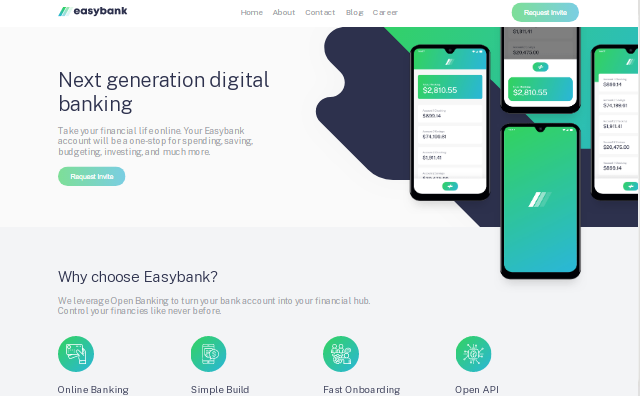

# Frontend Mentor - Easybank landing page solution

## Table of contents

- [Overview](#overview)
  - [Screenshot](#screenshot)
  - [Links](#links)
- [My process](#my-process)
  - [Built with](#built-with)
  - [What I learned](#what-i-learned)
  - [Continued development](#continued-development)
- [Author](#author)

## Overview

### Screenshot



### Links

- Solution URL: [Add solution URL here](https://your-solution-url.com)
- Live Site URL: [Add live site URL here](https://your-live-site-url.com)

## My process

### Built with

- React
- SCSS
- Flexbox
- CSS Grid
- Laptop-first workflow

### What I learned

I finally had a good grasp of intersection observer api. I used it to create a stick header and reveal sections as i scroll.

```scss
.featureItem {
  margin-bottom: 2rem;

  @media only screen and (max-width: $bp-smallest) {
    margin-bottom: 0;
    margin: 2rem 3rem;
  }

  & h3 {
    font-size: 2rem;
    font-weight: 300;
    margin-top: 2rem;
    color: $color-primary-1;
    animation-name: titleAnimation;
    animation-timing-function: ease-in-out;
    animation-duration: 6s;
    animation-fill-mode: forwards;
  }
  & p {
    width: 100%;
  }
```

```React
useEffect(() => {
    const current = containerRef.current;
    const observer = new IntersectionObserver(callBackFn, options);

    if (current) observer.observe(current);

    return () => {
      if (current) {
        observer.unobserve(current);
        console.log(current);
      }
    };
  }, [containerRef]);
};
```

### Continued development

I would love to do more with the intersection observer api. I also would want to practice http request, ajax and asynchronous javascript.

## Author

- Frontend Mentor - [@ejim11](https://www.frontendmentor.io/profile/@ejim11)
- Twitter - [@favourejim56](https://www.twitter.com/@favourejim56)
